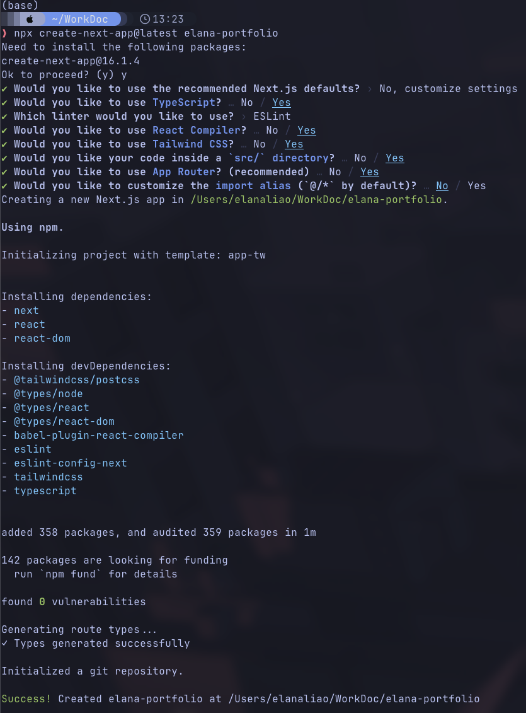

# My Personal Portfolio

Hi! I am Elana Liao, welcome to the repository for my personal portfolio! This project is built using a modern web stack to showcase my work, experience, and Github activity.

## The Tech Stack

+ Next.js
+ React
+ TypeScript
+ Tailwind CSS
+ Motion
+ Github API

## Dev Diary: How to Build This

### Part 1: Local Development Setup

If you want to replicate this project or run it locally to make it your own version, follow these steps:

1. Initialise the Project


2. Install Dependencies

```(bash)
npm insall motion
```

3.  Project Structure
   ```
   src
├── app
│   ├── (home)               # The main landing page (The "Grid" or "Dashboard")
│   │   ├── page.tsx
│   │   ├── components       # Shared UI specific to the landing page
│   │   │   ├── hi-card.tsx         <-- Reused
│   │   │   ├── clock-card.tsx      <-- Reused
│   │   │   ├── project-preview.tsx
│   │   │   └── tech-stack-card.tsx
│   ├── projects             # Detailed case studies
│   │   ├── [slug]
│   │   │   └── page.tsx
│   │   └── list.json        # Data source for projects
│   ├── contact              # Dedicated contact form/info
│   │   └── page.tsx
│   ├── layout.tsx           # Global providers, background, and navigation
│   └── api                  # Backend functions (if needed for forms/emails)
│       └── contact/route.ts
├── components               # Atomic/Generic UI components
│   ├── ui                   # Low-level components (Buttons, Cards, Inputs)
│   ├── widgets              # The reused logic-heavy cards (Music, Clock, etc.)
│   └── layout               # Header, Footer, Background effects
├── hooks                    # Reused logic (use-auth, use-theme, use-size)
├── lib                      # Utility functions (GitHub client, Formatter)
├── content                  # MDX or JSON files for site data
│   └── projects.mdx
└── public                   # Static assets (Favicon, OG Images)
```

